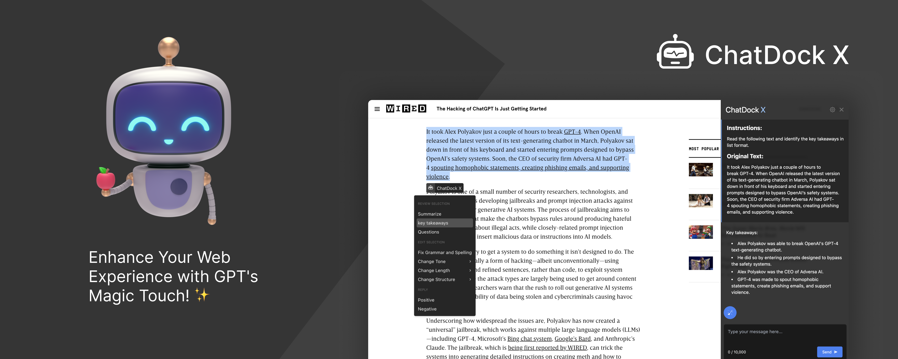

# 🌟 ChatDockX

ChatDockX is a Chrome extension that enables users to chat with ChatGPT by opening a sidebar on any website by using the shortcut `ctrl+shift+i`. In addition, it provides a floating menu underneath any selected text on any website that allows users to generate text summaries, check grammar issues, and customize text length.

## 🦾 Features

- 🗨️ Chat with ChatGPT through a sidebar.
- 🔑 User your own Open AI API key.
- 📜 Quick menu underneath any selected text which allows you to summarize, simplify language, translate, and more.
- 💯 Fully customizable settings page.
- 🎨 Has both light mode and dark mode !
- 🔐 Secure and fully Free and open source forever. (Please consider giving this project a star 🌟 and contributing 💖 to support the project.)

## 🐳 Installation

You can install ChatDockX through the Chrome Web Store. (Under Review)

Alternatively, you can install ChatDockX manually by following these steps:

1. Download the ZIP file of the repository by clicking on the "Code" button on this page and selecting "Download ZIP".
2. Extract the ZIP file to a folder on your computer.
3. Open Google Chrome and go to the "Extensions" page by typing "chrome://extensions/" in the address bar.
4. Turn on "Developer mode" by toggling the switch in the top right corner of the page.
5. Click on the "Load unpacked" button in the top left corner of the page.
6. Select the folder where you extracted the ZIP file.

## 💫 Usage

To use ChatDockX, simply press the shortcut ctrl+shift+i on any website to open the sidebar and start chatting with ChatGPT. To use the text-related features, select the text on the website and click on the floating menu that appears underneath the selection.

### Quick Menu

When you select a text, a quick menu will appear with the following options:

#### REVIEW SELECTION

- Summarize
- Simplify language
- Translate
- Key takeaways

#### EDIT SELECTION

- Fix spelling and grammar
- Change tone
- Make shorter
- Make longer

#### REPLY

- Reply positively
- Reply negatively
- Needs information

Note that these are default options and can be changed in the settings page.

## 💖 Contributing

Thank you to all the contributors who have helped make ChatDockX better! 👏

You can also contribute to the project by creating a pull request. please follow these steps:

1. Fork the repository by clicking on the "Fork" button on this page.
2. Clone your fork to your local machine.
3. Create a new branch from the main branch with a descriptive name.
4. Make your changes and commit them with a descriptive commit message.
5. Push your branch to your fork.
6. Create a pull request on this repository with a descriptive title and message.

Checkout the [CONTRIBUTING.md](
    https://github.com/Royal-lobster/ChatDockX/blob/main/CONTRIBUTING.md
) file for more information. 

## 🔎 Issues and Pull Requests

If you encounter any issues while using ChatDockX or want to suggest new features, please create an issue on this repository. If you want to contribute to the project, please create a pull request for existing [Issues](https://github.com/Royal-lobster/ChatDockX/issues?q=is%3Aissue+is%3Aopen+sort%3Aupdated-desc)

## 📦 License

ChatDockX is licensed under the MIT License. See the [LICENSE](https://github.com/Royal-lobster/ChatDockX/blob/main/LICENSE)
